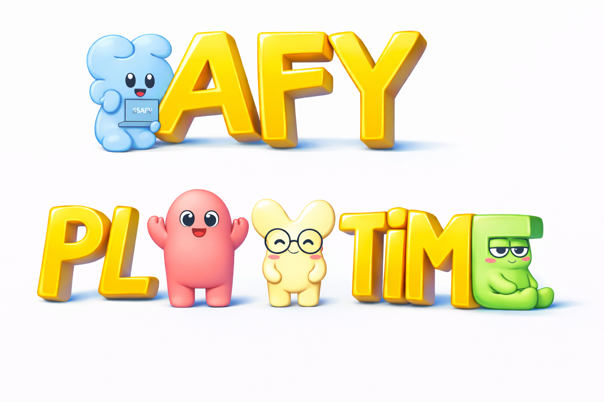

# SsafyPlayTime

> ## ⚔️ 친구들과 웃으며 즐기는 물리 기반 멀티플레이 파티 게임

- **서비스명**: SsafyPlayTime
- **개발 기간**: 2026.02.19 ~ 2026.03.30
- **개발 인원**: 6명 (Unity Client : 6명)

 

# 목차

- [💡 기획 배경](#-기획-배경)
- [✨ 서비스 주요 기능](#-서비스-주요-기능)
- [📱 주요 화면 및 기능 소개](#-주요-화면-및-기능-소개)
- [🛠️ 프로젝트 핵심 기술](#core-tech)
- [🏗️ 시스템 아키텍처](#architecture)
- [👥 팀원 소개](#-팀원-소개)
- [⚙️ 기술 스택](#tech-stack)

 

# 💡 기획 배경

### 기존 게임의 피로 요소
- 🎯 의무적인 미션 수행 : 재미보다 보상 획득이 우선되어 플레이 피로도가 높아짐
- 📝 복잡한 가입 절차 : 실명 인증·이메일 인증 등 번거로운 과정으로 이탈이 발생함
- ⏱️ 길어지는 플레이타임 : 한 판의 소요 시간이 길어 가볍게 즐기기 어려움
- 🚧 높은 진입장벽 : 복잡한 시스템과 구조로 인해 신규 유저의 접근이 어려움

### SSAFY PlayTime이 제안하는 개선 방향
> **움직이고, 부딪히고, 던지는 그 순간 자체가 재미가 되도록**
- ⚡ **순간의 재미** — 움직이고, 부딪히고, 던지는 과정 자체에서 즉각적인 재미를 제공
- 🕹️ **직관적인 플레이** — 복잡한 설명 없이 뛰고, 줍고, 던지는 단순한 조작으로 누구나 쉽게 적응
- 🪶 **가벼운 플레이 경험** — 빠른 템포의 캐주얼한 진행으로 부담 없이 반복 참여 가능

 

# ✨ 서비스 주요 기능

### 🏠 멀티플레이 로비
- 방 생성 / 입장 / 목록 실시간 업데이트
- 캐릭터 선택 및 모든 참가자 화면 동기화
- 방장 / 참가자 권한 분리 및 준비 상태 동기화

### 💣 공격 아이템
- 블랙홀 폭탄 / 화염 방사기 / 위성 폭격으로 상대 탈락
- 상황에 맞는 아이템 선택으로 전황 역전

### 🔮 변신 아이템
- 커지기 / 작아지기 / 투명화 아이템으로 기믹 역이용
- 위기 상황에서 생존 전략 수단으로 활용

### 👻 유령 투척 시스템
- 탈락 후 유령이 되어 폭탄 · 바나나 껍질 투척
- 생존자들의 경기에 지속적으로 영향을 줄 수 있는 참여 구조

### 👁️ 관전 카메라
- 탈락 후 유령이 되어 폭탄 · 바나나 껍질 투척
- 게임 흐름을 끝까지 관전 가능

### 🏆 게임 종료 및 랭킹
- 게임 종료 순위 결과 모든 참가자 화면에 동일하게 반영
- 탈주 / 방장 강제 종료 시 로비로 안전하게 복귀하는 예외 처리

 

# 📱 주요 화면 및 기능 소개

### 1. **로비**

- 방을 생성하거나 목록에서 방을 선택해 입장할 수 있습니다.
- 캐릭터 선택 시 모든 참가자 화면에 실시간으로 반영됩니다.
- 방장 외 모든 참가자가 준비 완료하면 방장이 게임을 시작할 수 있습니다.

### 3. **공격 아이템**

- 블랙홀 폭탄·화염 방사기·위성 폭격으로 다른 플레이어를 탈락시킬 수 있습니다.
- 각 아이템마다 범위·지속시간·효과가 달라 상황에 맞는 선택이 중요합니다.

### 4. **변신 아이템**

- 커지기·작아지기·투명화 아이템으로 위기 상황을 역전할 수 있습니다.
- 상대의 공격을 피하거나 기믹을 역이용하는 전략 수단으로 활용됩니다.

### 5. **유령 투척 시스템**

- 탈락 후 유령이 되어 생존자들에게 폭탄·바나나 껍질을 던질 수 있습니다.
- 탈락 이후에도 경기에 영향을 줄 수 있어 끝까지 긴장감이 유지됩니다.
- 관전 카메라로 살아있는 다른 플레이어를 자유롭게 구경할 수 있습니다.

### 6. **게임 종료 및 랭킹**

- 게임 종료 시 전체 순위 결과가 모든 참가자 화면에 동시에 표시됩니다.
- 1등이 새로운 방장이 되어 로비로 복귀하고 바로 다음 게임을 시작할 수 있습니다.

 

